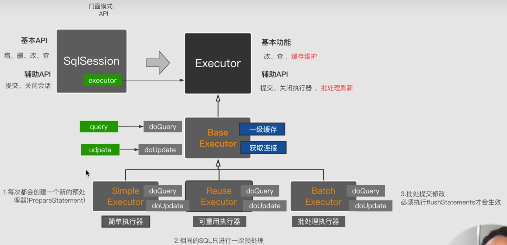
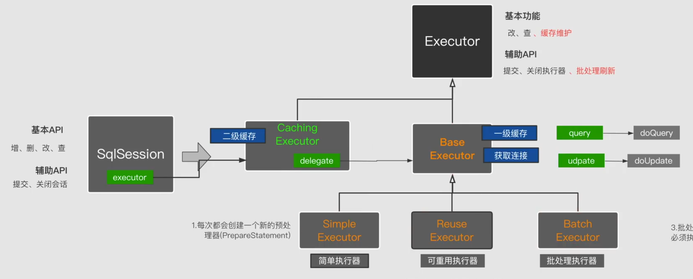
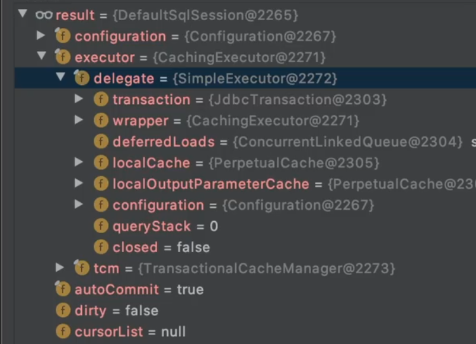
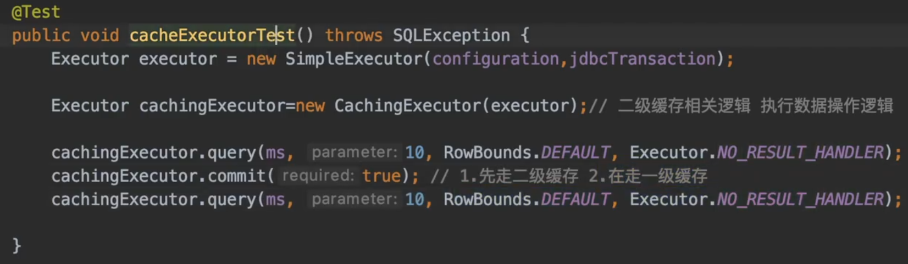

# MybatisAnalysis
Analyze the source code of mybatis

Mybatis执行器1
一级缓存中的数据是在SQL执行之后就立刻缓存的。

Mybatis执行器2  
MybatisSqlSession执行的逻辑如下：  

二级缓存执行测试：  
1、这里可以需要commit一下，否则二级缓存不会生效
2、分析CachingExecutor.java我们可以知道，其是通过装饰者模式来装饰BaseExecutor来实现的，避免了BaseExecutor的逻辑过于复杂，在其基础上扩展了二级缓存的逻辑。  
  

疑问解析：  

1、在 MyBatis 中，二级缓存的数据为什么需要在事务提交（commit）后才会被存储？  
二级缓存是跨 SqlSession 的缓存（多个 SqlSession 可共享），其核心目标之一是避免缓存中的数据与数据库数据出现不一致，尤其在多事务并发场景下。  
MyBatis 二级缓存需要在 commit 后才存储数据，本质是为了保证缓存数据与数据库数据的一致性，避免事务未确认时的中间状态数据污染缓存，同时通过与事务生命周期绑定，实现了跨 SqlSession 的安全数据共享。